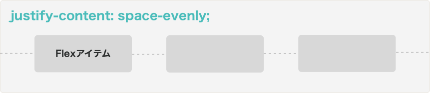
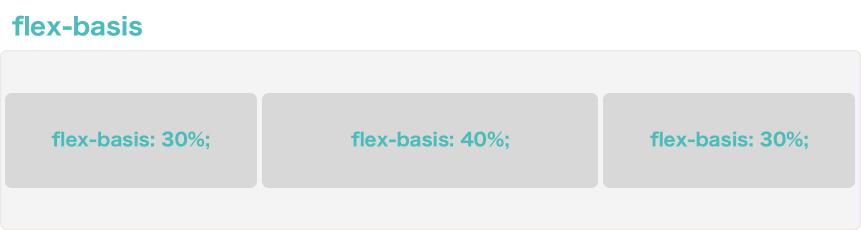

# Flexboxでレイアウトをもっと手軽に

## 目的

- Flexboxでレイアウトが出来るようになる

## Flexboxとは？

前回のレッスンでは、Floatを利用してWebページのレイアウトをデザインする方法を学びました。このFloatでのレイアウトをあまり直感的でないな、と感じた方もいるのではないでしょうか？ それもそのはずで、元々Floatは文字に回り込んで画像を表示させる、というようなシンプルなレイアウトデザインのために作られました。そのため、より複雑なレイアウトをデザインをするには、様々なテクニックを駆使する必要がありました。

このレイアウトをもっと簡単に出来るようにするために出来たのがFlexbox(Flexible Box)です。

## Flexboxのブラウザ対応状況について

Flexbox自体は2009年から既に利用出来るようになっていましたが、これまでは対応しているのが一部のブラウザだけだったり、またブラウザごとに異なるシンタックス(構文)が採用されていたりと使いづらく浸透していませんでした。しかし、2015年に新しいシンタックスが制定されたことや、Flexboxに完全対応していなかった古いインターネットエクスプローラーのサポートが終了したことで、一気に採用されるケースが増えています。

[ブラウザ実装状況 - MDN](https://developer.mozilla.org/ja/docs/Web/CSS/CSS_Flexible_Box_Layout/Using_CSS_flexible_boxes#Browser_compatibility)

## Flexboxの基本用語

### Flexコンテナー(Flex Container)とFlexアイテム(Flex Items)

### メイン軸(Main Axis)

Flexboxでは"flex-direction"というプロパティでFlexアイテムを横に並べるか縦に並べるか指定することが出来ます。この時、"flex-direction:row"の時は横軸がメイン軸となり、逆に"flex-direction:column"の時には縦がメイン軸となります。

### 交差軸(Cross Axis)

交差軸は名前の通り、メイン軸と直角に交わる軸を表します。

### メインサイズと交差サイズ

メインサイズとはFlexコンテナーのメイン軸方向の長さを示しています。逆に交差サイズは交差軸方向の長さを示します。横軸がメイン軸であれば、メインサイズは四角形の横幅を表し、交差サイズは四角形の縦幅を表します。

## Flexコンテナーのプロパティ

### 要素をFlexコンテナーへと変える

あるHTML要素をFlexコンテナーへ変えるには、displayプロパティにflexという値をセットします。また必要な場合は`inline-flex`と値を設定することで、Flexコンテナーをインライン要素とすることも出来ます。

```css
.container {
  display: flex; /* flex | inline-flex */
}
```

### flex-direction

Flexコンテナー内のFlexアイテムの方向を決めるには`flex-direction`プロパティを使用します。何も指定しない場合`flex-direction:row`が自動的に適用されます。また通常、`row`であれば左から右、`column`であれば上から下へとFlexアイテムが置かれますが、`row-reverse`のようにreverseを追加することでこれを逆にすることも出来ます。例えばチャットメッセージなどでは画面の一番下からスタートして、上に向かって古いメッセージを並べます。`column-reverse`を利用するとこれが簡単に実現出来ます。

```css
.container {
  display: flex;
  flex-direction: row; /* row(デフォルト) | column | row-reverse | column-reverse */
}
```


### flex-wrap

デフォルトでは、Flexコンテナー内の全てのFlexアイテムは一列に並びます。しかし、例えばFlexアイテムのメインサイズを固定したい時などは、`flex-wrap: wrap`と設定することで、Flexアイテムが次の行に回り込むように出来ます。

```css
.container {
  display: flex;
  flex-wrap: wrap; /* nowrap(デフォルト) | wrap | wrap-reverse */
}
```


### flex-flow

`flex-flow`は`flex-direction`と`flex-wrap`を1行で表すために利用します。例えば以下の2つは同じ意味です。

1. `flex-flow`未使用

```css
.container {
  display: flex;
  flex-direction: column;
  flex-wrap: wrap;
}
```

2. `flex-flow`使用

```css
.container {
  display: flex;
  flex-flow: column wrap;
}
```

### justify-content

`justify-content`はFlexコンテナー内のFlexアイテムを**メイン軸沿い**にどのように並べるのかを指定するために使います。例えば`center`という値を入れると、全てのFlexアイテムが中央に寄せられます。

```css
.container {
  display: flex;
  justify-content: center;
  /*
    flex-start(デフォルト) | flex-end | center |
    space-between | space-around | space-evenly
  */
}
```

- flex-start

メインスタートからメイン軸に沿って順番に並びます。


- flex-end

メインエンドからメイン軸に沿って順番に並びます。


- center

中央揃いになります。


- space-between:

メインスタートとメインエンドに最初と最後のアイテムが置かれます。残りのFlexアイテムは均等のスペースで置かれます。


- space-around

端も含めて全てのFlexアイテムの左右のスペースが同じになるように並びます。アイテムとアイテムの間は2つ分のスペースで計算されます。


- space-evenly
端も含めて全てのFlexアイテムの左右のスペースが同じになるように並びます。`space-around`とは異なりアイテムとアイテムの間も1つ分のスペースとして計算されます。



### align-items

`align-items`はFlexコンテナー内のFlexアイテムを**交差軸沿い**にどのように並べるのかを指定するために使います。例えば`center`という値を入れると、全てのFlexアイテムが交差軸の中央に置かれます。

```css
.container {
  display: flex;
  align-items: center;
  /*
    flex-start(デフォルト) | flex-end | center |
    baseline | stretch;
  */
}
```

- flex-start

交差スタートから交差軸に沿って順番に並びます。


- flex-end

交差エンドから交差軸に沿って順番に並びます。


- center

中央揃いになります。


- baseline

Flexアイテムのbaselineが揃うように並びます。


- stretch

交差サイズまで全てのアイテムの交差軸方向の長さが引き伸ばされます。


### align-content

align-contentは`flex-wrap`の値が`wrap`または`wrap-reverse`で、2列以上に渡ってFlexアイテムが並んでいる場合のみに適用されます。align-contentを利用すると複数列のFlexアイテムを、どのように交差軸上に配置するかを設定することが出来ます。

```css
.container {
  display: flex;
  align-content: center;
  /*
    flex-start(デフォルト) | flex-end | center |
    space-between | space-around | stretch;
  */
}
```

- flex-start

`flex-start`を設定すると交差スタートから交差エンドの方向に列が順番に並びます。


- flex-end

`flex-end`を設定すると交差エンドから交差スタートの方向に列が順番に並びます。


- center

`center`を設定すると交差軸上に列が中央揃えとなります。


- space-between

`space-between`を設定すると交差軸上で端にはスペースが入らず、列間のスペースは均等に割り振られます。


- space-around

`space-around`は端にもスペースが入ります。列間のスペースはスペース2個分として計算されます。


- stretch

`stretch`は列の考査軸上の長さが交差サイズを全て埋めるまで伸びます。たとえば2つの列がある場合だったら1つの列が交差サイズの半分の長さとなります。


## Flexアイテムのプロパティ

### order

デフォルトで全てのFlexアイテムの`order`プロパティの値は0が入っています。このプロパティに例えば-1を設定すると、アイテムの並びで-1が設定されたアイテムが先に表示されます。逆に1を設定するとアイテムの並びで1が設定されたアイテムが最後に表示されます。値には任意の数字を入れることが出来ます。

例:
```css
.item1 {
  order: 1
}
.item2 {
  order: -2
}
.item3 {
  order: 10;
  /*
    flex-start(デフォルト) | flex-end | center |
    space-between | space-around | stretch;
  */
}
```


### flex-grow

`flex-grow`プロパティは、Flexアイテムのメイン軸で占める長さを設定するために利用します。デフォルトでは全てのプロパティの値は1です。例えば、あるFlexアイテムのみ`flex-grow:2;`を設定すると、そのアイテムの長さは他のアイテムの2倍となります。


### flex-shrink

`flex-shrink`は`flex-wrap:nowrap`で、Flexアイテムがコンテナーより大きくなり縮む必要が出たときに他のアイテムとくらべてどの程度縮むのかを定義します。デフォルトでは1が入っています。例えば`flex-shrink:3`となっている時は、そのアイテムは他のアイテムの3倍の割合で縮みます。

例えば以下の例で考えて見ましょう。

```html
<ul class="flex-container">
  <li class="flex-item flex1">1</li>
  <li class="flex-item flex2">2</li>
</ul>
```
```css
.flex-container {
  padding: 0;
  margin: 0;
  list-style: none;

  -ms-box-orient: horizontal;
  display: -webkit-box;
  display: -moz-box;
  display: -ms-flexbox;
  display: -moz-flex;
  display: -webkit-flex;
  display: flex;
}

.flex-item {
  background: #D9728E;
  padding: 10px;
  border: 5px solid red;
  color: white;
  font-weight: bold;
  font-size: 2em;
  text-align: center;
}
.flex1 {
  flex-grow: 1;
  flex-shrink: 1;
  flex-basis: 50%;
}
.flex2 {
  flex-grow: 1;
  flex-shrink: 3;
  flex-basis: 50%;
}
```


[サンプルコード](https://github.com/codegrit-jp-students/codegrit-html-css-lesson04-sample-flex-shrink)

この時、flex-basisがどちらのアイテムも`50%`となっていて、2つで画面の幅全て100%を取ることになっています。ところがボーダーが`15px`となっているために、アイテムが縮まないと`100% + 60px`の長さになります。

そのため、この２つのFlexアイテムは併せて60px縮む必要があります。

この時に`.flex2`が適用されているFlexアイテムは`.flex1`の3倍縮むため。

`60px / (3 + 1) ✕ 3 = 45px`となり45px縮みます。見ます。逆にもう一つのアイテムは15pxだけ縮みます。

例えば画面の幅が仮に1100pxだったとすると、最終的に`.item1`は幅535px、`.item2`は幅505pxとなります。borderと合わせると1100pxとなりピッタリ画面に収まります。


`flex-shrink:0;`とした場合、そのアイテムは画面のサイズが変わっても縮みません。これは例えば、、固定サイドバーを置いてその幅を変えたくないという場合などで役立ちます。

### flex-basis

`flex-basis`はFlexアイテムのデフォルトのメイン軸上のサイズを決めるために使います。

```css
.item {
  flex-basis: auto;
  /*
    auto(デフォルト) | px | em | % |
  */
}
```



### flex

`flex`プロパティは`flex-grow`、`flex-shrink`、`flex-basis`の3つを1行で書くために使います。以下の2つの例は同一の意味です。デフォルトでは`0 1 auto`が設定されています。

```css
.item {
  flex-grow: 1;
  flex-shrink: 2;
  flex-basis: auto;
}
```

```css
.item {
  flex: 1 2 auto;
}
```

また、`auto`、`initial`、`none`で値を設定することが出来、この場合それぞれ`flex: 1 1 auto`、`flex: 0 1 auto`、`flex: 0 0 auto`を意味します。

### align-self

Flexコンテナーで`aline-items`プロパティを利用して全てのFlexアイテムをどう交差軸上で表示するかを設定できました。`align-self`は全てのアイテムではなく1つのアイテムの交差軸上での表示位置を設定するために利用します。値には`align-items`と同一のものを設定出来ます。

```css
.item {
  align-self: center;
  /*
    flex-start(デフォルト) | flex-end | center |
    baseline | stretch;
  */
}
```

## Flexコンテナーをネストする

Flexコンテナー内にFlexコンテナーを置くことも可能です。

例:
```html
<!DOCTYPE html>
<html>
<head>
  <style>
    .container {
      width: 120px;
      border: 1px solid blue;
      padding: 5px;
      display: flex;
      flex-direction:column
    }
    .item.sub-1 {
      align-self: center;
    }
    .sub-container {
      display: flex;
      flex-direction: row;
      justify-content: space-between;
    }
    .square {
      height: 40px;
      width: 40px;
      background-color: yellow;
    }
  </style>
</head>
<body>
  <div class="container">
    <div class="item sub-1">
      <div class="square">
        1
      </div>
    </div>
    <div class="item sub-container">
      <div class="sub-container-item">
        <div class="square">2</div>
      </div>
      <div class="sub-container-item">
        <div class="square">3</div>
      </div>
    </div>
  </div>
</body>
</html>
```


[サンプルコード](https://github.com/codegrit-jp-students/codegrit-html-css-lesson04-sample-nest)

## チャレンジ

[チャレンジ4](./challenge/README.md)

## 更に学ぼう

### 記事で学ぶ

[CSS flexible box の利用 - MDN](https://developer.mozilla.org/ja/docs/Web/CSS/CSS_Flexible_Box_Layout/Using_CSS_flexible_boxes)

### 動画で学ぶ

[ドットインストール - Flexbox入門](https://dotinstall.com/lessons/basic_flexbox)

### ゲームで学ぶ

[Flexbox Froggy](http://flexboxfroggy.com/#ja)
