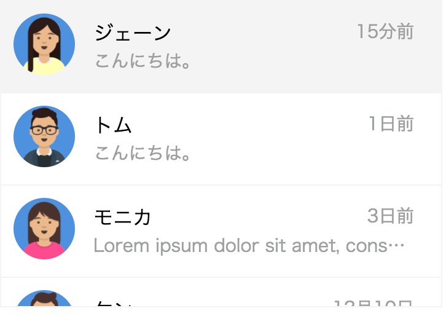

# チャレンジ4

```
所要時間: 30分
ステータス: 公開
タイプ: 課題
```

## 目的
- Flexboxのコンテナーとアイテムの違いを理解する
- Flexboxを使ってWebサイトの主要パーツを作れるようになる

## チャレンジの取り組み方

1. マイルストーンごとに要件に合うようにファイルを編集していきます。
2. 分からない部分があれば、テキストを復習して、再度チャレンジしてみましょう。
3. 再チャレンジしてしばらく考えても分からない場合はチャットでメンターに質問しましょう。
4. 完成したら、Dropboxでメンターとファイルを共有して下さい。
5. メンターから課題レビューが届きます。
6. ビデオチャットの際は、分からない点を更に突っ込んで聞いたり、より良い書き方を聞いてみましょう。

## 概要

例えばFacebookでチャットを利用していると右側には現在開いている(アクティブな)チャットが表示されており、左側にはこれまでにチャットをした人やグループが時系列(上が新しく、下にいくほど古い)で並んでいます。今回はFlexboxを活用してこの左側のリストを作っていきましょう。



## スターターファイル

以下のURLのコードをテンプレートとして利用して下さい。

- [codegrit-html-css-ch04-starter](https://github.com/codegrit-jp-students/codegrit-html-css-ch04-starter)

## マイルストーン1

### 要件(スペック)

- チャットでやり取りした人の一覧は縦に並びます。
- アバターが一番左側にあります。
- 右側は上下2段に分かれています。
- 上の段は、左と右側に分かれており左側には相手の名前、右側には最後のメッセージの日付があります。
- 下の段には、最後のメッセージが1行で表示されています。
- 最後のメッセージが長く、1行に表示しきれない場合は`...`を表示します。

### ヒント

- `flex-direction`プロパティを上手く使って、要素を縦並び、横並びに配置しましょう。
- `justify-content`プロパティを利用して、名前と日付が上手く表示されるようにしましょう。
- `...`を表示するには`text-overflow`プロパティと`overflow`プロパティを利用します。
- 長い文章を1行に収めるには、`white-space`プロパティを利用します。


## 評価

課題の後、以下の２つについてメンターにフィードバックをお願いします。

1. 要件のカバー度: 1.全く出来なかった 2.ほとんど出来なかった 3. 半分ほどは出来た 4.8割ほどは出来た 5. 全部出来た
2. 難易度: 1. とても難しかった 2. 難しかった 3. ちょうど良かった 4. 簡単だった 5. とても簡単だった
