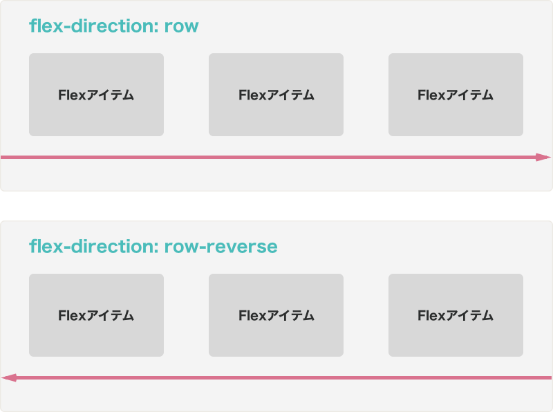
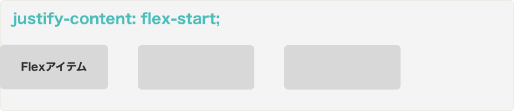
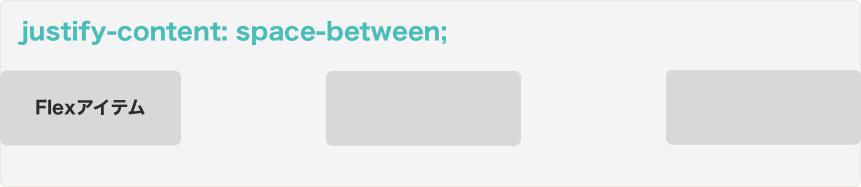
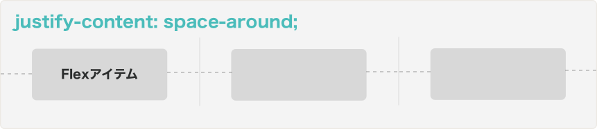
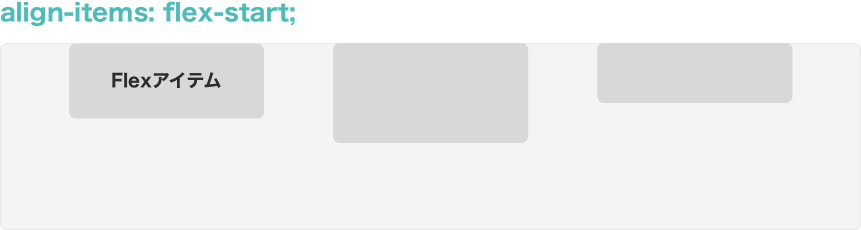
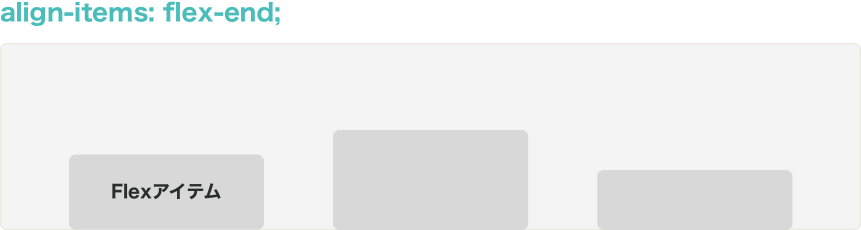
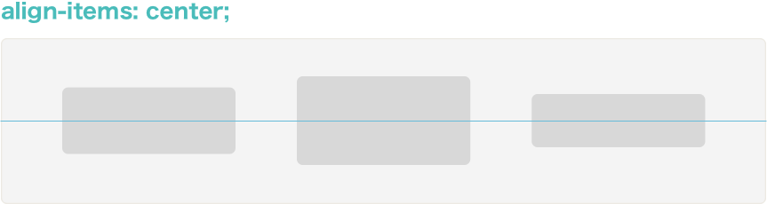
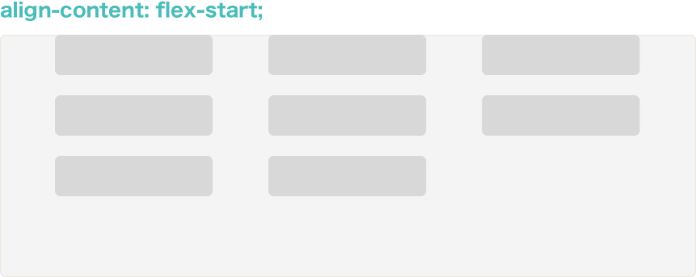
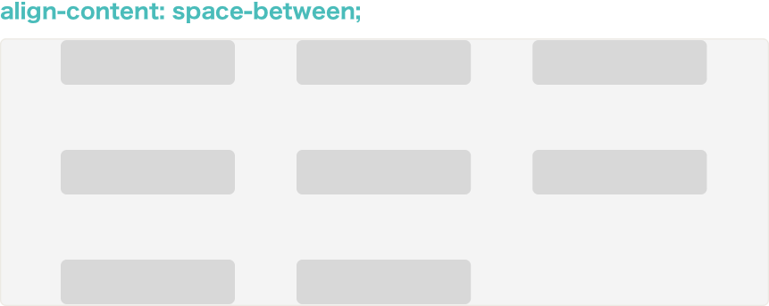
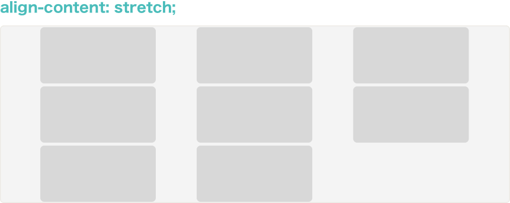

## Flexコンテナーのプロパティ

### 要素をFlexコンテナーへと変える

あるHTML要素をFlexコンテナーへ変えるには、displayプロパティにflexという値をセットします。また必要な場合は`inline-flex`と値を設定することで、Flexコンテナーをインライン要素とすることも出来ます。

```css
.container {
  display: flex; /* flex | inline-flex */
}
```

### flex-direction

Flexコンテナー内のFlexアイテムの方向を決めるには`flex-direction`プロパティを使用します。何も指定しない場合`flex-direction:row`が自動的に適用されます。また通常、`row`であれば左から右、`column`であれば上から下へとFlexアイテムが置かれますが、`row-reverse`のようにreverseを追加することでこれを逆にすることも出来ます。例えばチャットメッセージなどでは画面の一番下からスタートして、上に向かって古いメッセージを並べます。`column-reverse`を利用するとこれが簡単に実現出来ます。

```css
.container {
  display: flex;
  flex-direction: row; /* row(デフォルト) | column | row-reverse | column-reverse */
}
```




### flex-wrap

デフォルトでは、Flexコンテナー内の全てのFlexアイテムは一列に並びます。しかし、例えばFlexアイテムのメインサイズを固定したい時などは、`flex-wrap: wrap`と設定することで、Flexアイテムが次の行に回り込むように出来ます。

```css
.container {
  display: flex;
  flex-wrap: wrap; /* nowrap(デフォルト) | wrap | wrap-reverse */
}
```


### flex-flow

`flex-flow`は`flex-direction`と`flex-wrap`を1行で表すために利用します。例えば以下の2つは同じ意味です。

1. `flex-flow`未使用

```css
.container {
  display: flex;
  flex-direction: column;
  flex-wrap: wrap;
}
```

2. `flex-flow`使用

```css
.container {
  display: flex;
  flex-flow: column wrap;
}
```

### justify-content

`justify-content`はFlexコンテナー内のFlexアイテムを**メイン軸沿い**にどのように並べるのかを指定するために使います。例えば`center`という値を入れると、全てのFlexアイテムが中央に寄せられます。

```css
.container {
  display: flex;
  justify-content: center;
  /*
    flex-start(デフォルト) | flex-end | center |
    space-between | space-around | space-evenly
  */
}
```

- flex-start

メインスタートからメイン軸に沿って順番に並びます。



- flex-end

メインエンドからメイン軸に沿って順番に並びます。


- center

中央揃いになります。


- space-between:

メインスタートとメインエンドに最初と最後のアイテムが置かれます。残りのFlexアイテムは均等のスペースで置かれます。



- space-around

端も含めて全てのFlexアイテムの左右のスペースが同じになるように並びます。アイテムとアイテムの間は2つ分のスペースで計算されます。



- space-evenly
端も含めて全てのFlexアイテムの左右のスペースが同じになるように並びます。`space-around`とは異なりアイテムとアイテムの間も1つ分のスペースとして計算されます。


### align-items

`align-items`はFlexコンテナー内のFlexアイテムを**交差軸沿い**にどのように並べるのかを指定するために使います。例えば`center`という値を入れると、全てのFlexアイテムが交差軸の中央に置かれます。

```css
.container {
  display: flex;
  align-items: center;
  /*
    flex-start(デフォルト) | flex-end | center |
    baseline | stretch;
  */
}
```

- flex-start

交差スタートから交差軸に沿って順番に並びます。



- flex-end

交差エンドから交差軸に沿って順番に並びます。



- center

中央揃いになります。




- baseline

Flexアイテムのbaselineが揃うように並びます。


- stretch

交差サイズまで全てのアイテムの交差軸方向の長さが引き伸ばされます。


### align-content

align-contentは`flex-wrap`の値が`wrap`または`wrap-reverse`で、2列以上に渡ってFlexアイテムが並んでいる場合のみに適用されます。align-contentを利用すると複数列のFlexアイテムを、どのように交差軸上に配置するかを設定することが出来ます。

```css
.container {
  display: flex;
  align-content: center;
  /*
    flex-start(デフォルト) | flex-end | center |
    space-between | space-around | stretch;
  */
}
```

- flex-start

`flex-start`を設定すると交差スタートから交差エンドの方向に列が順番に並びます。



- flex-end

`flex-end`を設定すると交差エンドから交差スタートの方向に列が順番に並びます。


- center

`center`を設定すると交差軸上に列が中央揃えとなります。


- space-between

`space-between`を設定すると交差軸上で端にはスペースが入らず、列間のスペースは均等に割り振られます。



- space-around

`space-around`は端にもスペースが入ります。列間のスペースはスペース2個分として計算されます。


- stretch

`stretch`は列の考査軸上の長さが交差サイズを全て埋めるまで伸びます。たとえば2つの列がある場合だったら1つの列が交差サイズの半分の長さとなります。

