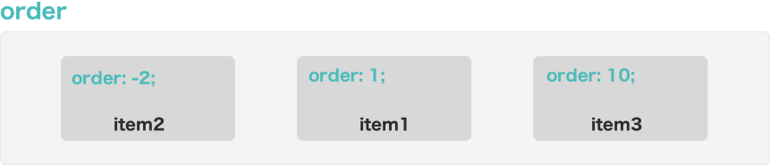
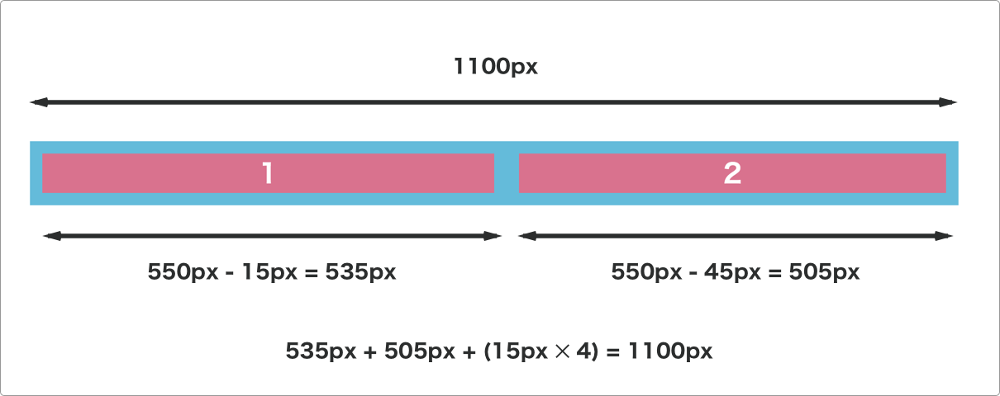

## Flexアイテムのプロパティ

### order

デフォルトで全てのFlexアイテムの`order`プロパティの値は0が入っています。このプロパティに例えば-1を設定すると、アイテムの並びで-1が設定されたアイテムが先に表示されます。逆に1を設定するとアイテムの並びで1が設定されたアイテムが最後に表示されます。値には任意の数字を入れることが出来ます。

例:
```css
.item1 {
  order: 1
}
.item2 {
  order: -2
}
.item3 {
  order: 10;
  /*
    flex-start(デフォルト) | flex-end | center |
    space-between | space-around | stretch;
  */
}
```



### flex-grow

`flex-grow`プロパティは、Flexアイテムのメイン軸で占める長さを設定するために利用します。デフォルトでは全てのプロパティの値は1です。例えば、あるFlexアイテムのみ`flex-grow:2;`を設定すると、そのアイテムの長さは他のアイテムの2倍となります。


### flex-shrink

`flex-shrink`は`flex-wrap:nowrap`で、Flexアイテムがコンテナーより大きくなり縮む必要が出たときに他のアイテムとくらべてどの程度縮むのかを定義します。デフォルトでは1が入っています。例えば`flex-shrink:3`となっている時は、そのアイテムは他のアイテムの3倍の割合で縮みます。

例えば以下の例で考えて見ましょう。

```html
<ul class="flex-container">
  <li class="flex-item flex1">1</li>
  <li class="flex-item flex2">2</li>
</ul>
```
```css
.flex-container {
  padding: 0;
  margin: 0;
  list-style: none;

  -ms-box-orient: horizontal;
  display: -webkit-box;
  display: -moz-box;
  display: -ms-flexbox;
  display: -moz-flex;
  display: -webkit-flex;
  display: flex;
}

.flex-item {
  background: #D9728E;
  padding: 10px;
  border: 5px solid red;
  color: white;
  font-weight: bold;
  font-size: 2em;
  text-align: center;
}
.flex1 {
  flex-grow: 1;
  flex-shrink: 1;
  flex-basis: 50%;
}
.flex2 {
  flex-grow: 1;
  flex-shrink: 3;
  flex-basis: 50%;
}
```


[サンプルコード](https://github.com/codegrit-jp-students/codegrit-html-css-lesson04-sample-flex-shrink)

この時、flex-basisがどちらのアイテムも`50%`となっていて、2つで画面の幅全て100%を取ることになっています。ところがボーダーが`15px`となっているために、アイテムが縮まないと`100% + 60px`の長さになります。

そのため、この２つのFlexアイテムは併せて60px縮む必要があります。

この時に`.flex2`が適用されているFlexアイテムは`.flex1`の3倍縮むため。

`60px / (3 + 1) ✕ 3 = 45px`となり45px縮みます。見ます。逆にもう一つのアイテムは15pxだけ縮みます。

例えば画面の幅が仮に1100pxだったとすると、最終的に`.item1`は幅535px、`.item2`は幅505pxとなります。borderと合わせると1100pxとなりピッタリ画面に収まります。



`flex-shrink:0;`とした場合、そのアイテムは画面のサイズが変わっても縮みません。これは例えば、、固定サイドバーを置いてその幅を変えたくないという場合などで役立ちます。

### flex-basis

`flex-basis`はFlexアイテムのデフォルトのメイン軸上のサイズを決めるために使います。

```css
.item {
  flex-basis: auto;
  /*
    auto(デフォルト) | px | em | % |
  */
}
```


### flex

`flex`プロパティは`flex-grow`、`flex-shrink`、`flex-basis`の3つを1行で書くために使います。以下の2つの例は同一の意味です。デフォルトでは`0 1 auto`が設定されています。

```css
.item {
  flex-grow: 1;
  flex-shrink: 2;
  flex-basis: auto;
}
```

```css
.item {
  flex: 1 2 auto;
}
```

また、`auto`、`initial`、`none`で値を設定することが出来、この場合それぞれ`flex: 1 1 auto`、`flex: 0 1 auto`、`flex: 0 0 auto`を意味します。

### align-self

Flexコンテナーで`aline-items`プロパティを利用して全てのFlexアイテムをどう交差軸上で表示するかを設定できました。`align-self`は全てのアイテムではなく1つのアイテムの交差軸上での表示位置を設定するために利用します。値には`align-items`と同一のものを設定出来ます。

```css
.item {
  align-self: center;
  /*
    flex-start(デフォルト) | flex-end | center |
    baseline | stretch;
  */
}
```