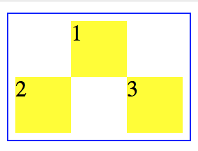

## Flexコンテナーをネストする

Flexコンテナー内にFlexコンテナーを置くことも可能です。

例:
```html
<!DOCTYPE html>
<html>
<head>
  <style>
    .container {
      width: 120px;
      border: 1px solid blue;
      padding: 5px;
      display: flex;
      flex-direction:column
    }
    .item.sub-1 {
      align-self: center;
    }
    .sub-container {
      display: flex;
      flex-direction: row;
      justify-content: space-between;
    }
    .square {
      height: 40px;
      width: 40px;
      background-color: yellow;
    }
  </style>
</head>
<body>
  <div class="container">
    <div class="item sub-1">
      <div class="square">
        1
      </div>
    </div>
    <div class="item sub-container">
      <div class="sub-container-item">
        <div class="square">2</div>
      </div>
      <div class="sub-container-item">
        <div class="square">3</div>
      </div>
    </div>
  </div>
</body>
</html>
```



[サンプルコード](https://github.com/codegrit-jp-students/codegrit-html-css-lesson04-sample-nest)

## 更に学ぼう

### 記事で学ぶ

[CSS flexible box の利用 - MDN](https://developer.mozilla.org/ja/docs/Web/CSS/CSS_Flexible_Box_Layout/Using_CSS_flexible_boxes)

### 動画で学ぶ

[ドットインストール - Flexbox入門](https://dotinstall.com/lessons/basic_flexbox)

### ゲームで学ぶ

[Flexbox Froggy](http://flexboxfroggy.com/#ja)
